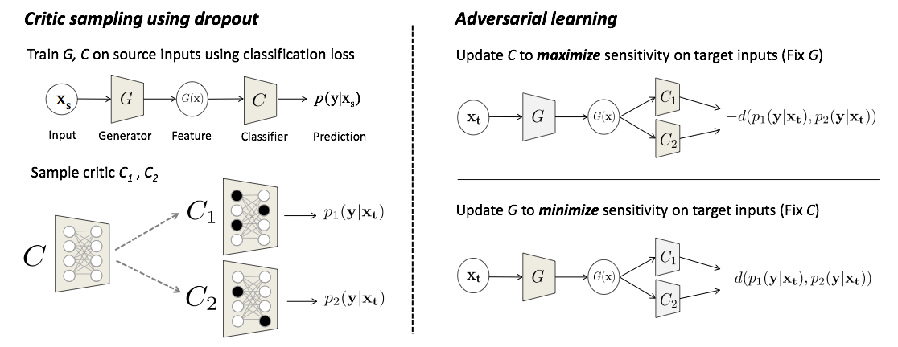
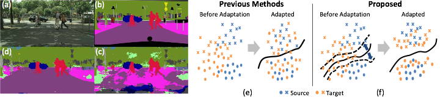

# Adversarial Dropout Regularization
Adversarial Dropout Regularization 算法的代码实现(PyTorch)

基于原作者Kuniaki Saito的代码修改而来

#### Adversarial Dropout Reguralization


## Getting Started


### ADR 训练/验证
例如, 从svhn迁移至mnist
```
python main.py --source svhn --target mnist
```

 Pytorch 版本冲突时，使用选项 --use_abs_diff，这会将测量值从 kl 散度更改为绝对差。
```
python main.py --source svhn --target mnist --use_abs_diff
```

## License
MIT
